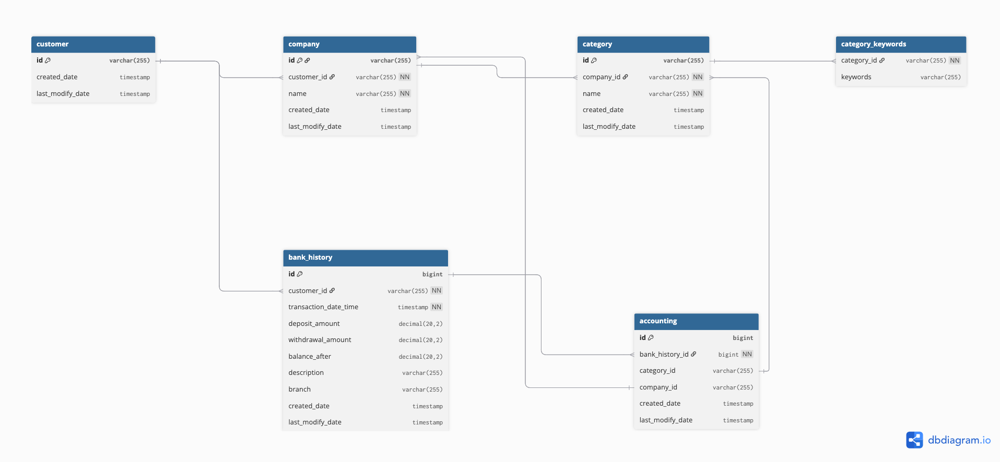

# A. 시스템 아키텍처
## 기술스택
### Language
- Java 17.0.3

### Framework
- Spring Boot 3.5.4

### Database
- JPA, H2, Postgres, QueryDSL

### Test
- Junit5
- Testcontainers
- Archunit

### 기술 스택 선택이유
빠른 개발 및 테스트를 위해 익숙한 Java 언어와 생태계가 풍부한 Spring Boot 프레임워크를 선택했습니다. 이는 초기 개발 속도를 높이고, 검증된 라이브러리 및 문서 접근성을 활용하기 위함입니다.

과제를 처음 접했을 때, 고객사-사업체-은행 등 여러 주체 간의 명확한 관계 설정과 데이터 무결성 보장을 위해 관계형 데이터베이스(RDB)가 더 적합하다고 판단했습니다. 이에 따라 RDB를 선택하였으며, 개발 생산성을 고려해 인메모리 데이터베이스인 H2를 테스트용으로 사용하였습니다.

JPA와 QueryDSL은 유지보수성과 가독성이 높고, 복잡한 쿼리 작성 시에도 안정성을 제공하므로 채택했습니다. 운영 환경에서는 신뢰성이 검증된 오픈소스 RDBMS인 PostgreSQL을 사용하였습니다.

## DB 스키마

### ERD


# B. 핵심 자동 분류 로직
## 자동 분류 로직
### 핵심 로직 설명

해당 로직의 핵심은 도메인 구조를 명확히 나누고, 역할별 책임을 분리한 점입니다. 이를 통해 유지보수성과 가독성을 확보하였으며, 각 기능 단위를 빠르게 식별하고 테스트할 수 있도록 설계했습니다.

구조 흐름은 아래와 같습니다.
1. /api/v1/accounting/process API를 통해 customerId와 CSV 파일과 JSON 파일을 업로드합니다.
2. bank_history.csv 파일의 데이터 그대로 은행이력 테이블에 저장합니다.
3. rules.json 파일을 통해  사업체->카테고리->키워드 정보를 각각의 테이블에 저장합니다.
4. 키워드가 은행이력 테이블의 적요에 포함된다면 사업체->카테고리->키워드 정보를 가져옵니다. 
5. Accounting 테이블에 은행이력, 사업체, 카테고리 정보를 저장합니다.
6. /api/v1/accounting/records API를 통해 companyId를 기준으로 Accountiung 테이블에서 데이터를 조합해 가져옵니다.

아래는 주요 로직입니다.
```
@Transactional
    public AccountingProcessResponse processAccounting(String customerId, MultipartFile csvFile, MultipartFile rulesFile) throws IOException {
        List<BankHistory> txs = bankHistoryService.save(customerId, csvFile);
        List<Category> categories = categoryService.save(rulesFile);
        List<Accounting> accountingList = txs.stream()
                .map(tx -> {
                    // 거래 내역의 적요에서 키워드 매칭
                    String description = tx.getDescription();
                    Category matchedCategory = categories.stream()
                            .filter(category -> category.getKeywords().stream()
                                    .anyMatch(description::contains))
                            .findFirst()
                            .orElse(null);
                    final Accounting.AccountingBuilder accountingBuilder =
                            Accounting.builder().bankHistory(tx);
                    return matchedCategory == null
                            ? accountingBuilder.build()
                            : accountingBuilder
                                    .categoryId(matchedCategory.getId())
                                    .companyId(matchedCategory.getCompany().getId())
                                    .build();
                })
                .collect(Collectors.toList());

        List<Accounting> saved = accountingRepository.saveAll(accountingList);

        return new AccountingProcessResponse(
                saved.size(),
                saved.stream().mapToInt(tx -> tx.getCategoryId() != null ? 1 : 0).sum(),
                saved.stream().mapToInt(tx -> tx.getCategoryId() == null ? 1 : 0).sum()
        );
    }
```

### 규칙이 복잡해질 경우 
- 추가 규칙이 몇개 수준이라면 로직내에서 조건을 추가하고 함수화해 가독성을 높이는 정도로만 구현합니다.
- 추가 규칙이 10개 이상이라면 규칙이라는 도메인을 따로 두고 규칙을 관리하는 방식으로 구현합니다. 사용자가 규칙을 삭제, 추가 또는 적용할 수 있도록 API를 제공하는 방향으로요. 

# C. 보안 강화 방안
모든 통신은 SSL을 사용합니다.
외부에서 접근할 수 있는 API 서버는 인증된 사용자만 접근할 수 있도록 JWT 토큰 기반 인증을 사용합니다.
데이터베이스는 외부에서 직접 접근할 수 없도록 방화벽 설정을 하고, 내부 네트워크에서만 접근 가능하도록 합니다.
파일 암호화를 위한 키관리용 API 서버도 내부 네트워크에서만 접근 가능하도록 구성하고, shh키로만 접속가능하도록 구축합니다.

# D. 문제상황 해결책 제시
시나리오: 한 고객사의 거래 데이터가 다른 고객사 대시보드에 노출되었다는 신고가 들어왔습니다.

1. 가장 먼저 대시보드를 막습니다.
2. 가장 원인이 될 가능성이 높은 코드부터 차례대로 검토합니다. (해당 문제는 데이터 저장 또는 조회쪽 문제일 확률이 크므로 그쪽 로직 먼저 확인)
3. 문제를 해결하고 테스트코드를 작성해 재발을 최대한 방지합니다.
4. 핫픽스로 빠르게 운영서버에 빠르게 반영합니다.

# E. 실행 및 테스트 가이드

1. java 17.0.3 이상과 docker가 설치되어 있어야 합니다.
   - Java 버전 확인: `java -version`
   - Docker 버전 확인: `docker -v`
2. mvnw compile 실행
3. mvnw package 실행
4. target 폴더로 이동해 아래 명령어로 실행합니다.
   - java -jar mini-ledger-0.0.1-SNAPSHOT.jar
5. localhost:8081/h2-console 접속하고 reousrces 경로 밑에 init.sql을 실행시켜줍니다.
   - JDBC URL: jdbc:h2:mem:testdb
   - User Name: sa
   - Password: (비워둠)
5. csvFile과 rulesFile을 준비하고 아래의 예제 CURL의 파일 경로를 수정합니다.
- curl --location --request POST 'http://localhost:8081/api/v1/accounting/process' \
   --form 'csvFile=@"/Users/lsh/Downloads/bank_transactions.csv"' \
   --form 'rulesFile=@"/Users/lsh/Downloads/rules.json"' \
   --form 'customerId="cus_1"
6. 위 CURL을 실행하면 http 200 응답과 함께 매핑 성공및 실패 건들의 값들이 반환되어야 합니다.
7. 조회 CURL 예시
- curl --location --request GET 'http://localhost:8081/api/v1/accounting/records?companyId=com_1'
8. com_1에 해당하는 거래내역 5개가 반환되어야합니다.


# 4. AI(LLM 등)를 활용해서 위 과제를 진행한 경우, 아래에 해당사항이 있다면 작성해주세요.
아키텍처와 플로우는 제가 구상한것이고, 실제 구현 부분과 코드 자동 완성등 편의 기능으로 도움을 받았습니다.
